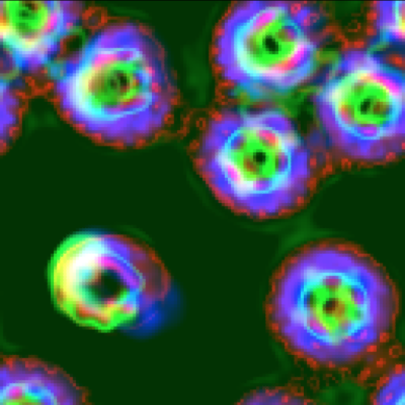

# "Get a life!"
### Continuous cellular automata
### Emergent life-like patterns in the virtual world of Lenia

by [Bert Chan](https://chakazul.github.io/), [Dirk Brockmann](http://rocs.hu-berlin.de/)

16 February, 2021

This explorable illustrates a type of **continuous cellular automata** called _Lenia_. It was derived from the famous discrete cellular automata, [**Conway's Game of Life**](https://www.complexity-explorables.org/explorables/nah-dah-dah-nah-nah-opus-1984/), by changing its rules in a couple of ways. The cells are no longer just dead or alive, but can take one of an infinite number of states. The local rule involves a much larger neighborhood, and the states are updated differentially.

Unlike the patterns found in the Game of Life, the emergent patterns or "creatures" discovered in _Lenia_ look and behave more like microorganisms as observed under a microscope. This may be due to the intrinsic **statistical, stochastic, fuzzy-logic-like** nature of continuous cellular automata that shares with biological systems. These continuous patterns exhibit **self-organization** and **self-repair**, as well as more advanced phenomena like structural symmetry, self-replication, polymorphism, and colony formation.

_**Press Play**_, try out the controls, and keep on reading ....

## This is how it works

Cellular automata can become continuous in terms of states, space or time, in _Lenia_ we make them all. Inside an n-dimensional lattice, each site has a continuous state variable with **real value** between 0 and 1, representing the level of activity. The states are visualized using a color gradient as seen in the display panel.

Each site $a_{ij}$ in the grid $\mathbf{A}$ interacts with an arbitrary large circular area of neighbors, and updates in a differential fashion akin to the [Euler method](https://en.wikipedia.org/wiki/Euler_method), making space and time continuous. The local rule goes like this:

1.  First take a **weighted sum** of neighbor sites with a weight distribution $\mathbf{K}$ (called kernel),
2.  then get the growth value using a function $G$ (called growth mapping),
3.  finally add a small portion $dt$ of the growth to the state $a_{ij}$ itself,
4.  don't forget to clip the value back to the interval $[0, 1]$.

Update the whole grid synchronously and repeatedly. The algorithm can be written in formula ($[\;]_0^1$ is the clip function):

$$ \mathbf{A}^{t+dt} = \big[ \mathbf{A}^t + dt \cdot G(\mathbf{K} * \mathbf{A}^t) \big]_0^1 $$

The weighted sum is mathematically a **convolution**. It can be interpreted as the "perception" of the world as being perceived by the "sensors" (kernel) of the creature. After a decision making process (growth mapping), the creature takes the appropriate "actions" (growth values) back to the world. This process mimics a **sensori-motor feedback loop** that may contribute to the self-organization of patterns.

In more advanced rules called _extended Lenia_, there can be multiple channels $\mathbf{A}_c$, multiple kernels and growth mappings $\mathbf{K}_k, \mathbf{G}_k$. The algorithm is similar, but the results are more surprising.

## Try this

_**Select a pattern**_ from the list, and observe its dynamic structure and behavior. Select again to randomly spawn 1-3 creatures. _**Gently move the space, time, and states sliders**_ to control the degree of smoothness of the system: to the left more discrete and coarse-grained, to the right more continuous and fine-grained. _**Move the mu and sigma sliders**_ to adjust parameters of the growth mapping. You may discover a new species with the right parameter values!

While playing with the sliders, _**switch to different views**_ to observe the effects of parameter changes. The _**world, weighted sum, and growth views**_ visualize each stage of cellular automata calculation, the _**kernel view**_ shows the kernel and the growth mapping.

## Model species

Like in biology, we can investigate how self-organizing patterns behave through a few "model species".

*   _**Orb**_ - It is the simplest pattern that possess **individuality**, meaning it can maintain a "personal space" and survive collisions. Can you feel the attractive & repulsive forces between them? You may also witness 2 of them fuse into a new species.
*   _**Chain**_ - It is a linear combination of smaller components. Try evolve shorter chains by adjusting the mu and sigma sliders.
*   _**Star**_ - Many species have **radial symmetry**. They are usually stationary (like real starfish) while rotating or oscillating.
*   _**Spinner**_ - Asymmetric patterns may be spinning or zig-zagging.
*   _**Shape-shifter**_ - Some edge case patterns have **chaotic behaviors**, like **metamorphosis** where the pattern keeps changing mode randomly. It is like it cannot decide which species to become, and in fact, it exists at the crossroads of various species (see [this parameter map](https://twitter.com/BertChakovsky/status/1128468956228927488), y-axis is mu, x-axis is sigma).
*   _**Self-replicator**_ - In _extended Lenia_ where the system has multiple kernels and multiple channels (shown in RGB colors), patterns have much more complex structures and behaviors. For example, this cloud-like creature can **self-replicate**.
*   _**Mother ship**_ - This pattern **emits smaller patterns**, analogous to "glider guns" or "rakes" in the Game of Life.
*   _**Amazing cells**_ - Some cell-like creatures are **polymorphic** - able to switch among various phenotypes, while engaging in **complex interactions**. How many phenotypes and combos can you find?
*   _**Bizarre cells**_ - They exhibit a kind of strange behavior that looks like communication (?), and they sometimes **form colonies**.
*   The last pattern is _**Gosper's glider gun**_ in the Game of Life. This is to demonstrate that discrete cellular automata is a special case of continuous cellular automata, and thus can be simulated inside _Lenia_ (using a step kernel).

## References

*   Chan, B. W.-C. (2019). Lenia: Biology of Artificial Life. _Complex Systems, 28_ (3), 251–286.
*   Chan, B. W.-C. (2020). Lenia and Expanded Universe. _Artificial Life Conference Proceedings_, (32), 221–229.
*   More resources on Lenia: [https://chakazul.github.io/lenia.html](https://chakazul.github.io/lenia.html)
